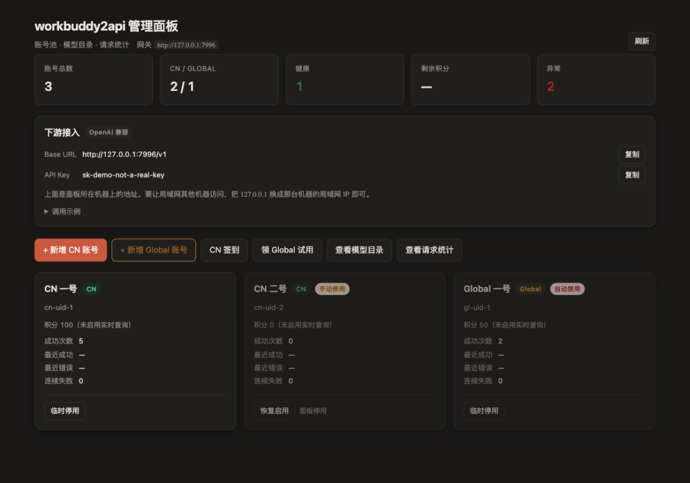

# wb2a-panel

[workbuddy2api](https://github.com/Sliverkiss/workbuddy2api) 的轻量 Web 管理面板。

**零依赖**（纯 Python 标准库）· **不 fork 网关**（只用它的 HTTP 接口）· **单文件启动**



<sub>截图用的是 stub 网关的演示数据（`tests/stub_gateway.py`），不含任何真实凭据。</sub>

---

## 为什么是这几个取舍

现有面板要么是网关的 fork（上游更新一版就得跟一次），要么需要 Go 编译或
`npm install`。这个面板刻意走另一条路：

| 取舍 | 意味着什么 |
|---|---|
| **零依赖** | 只用 Python 标准库。不用 `pip install`，不用编译，不用构建。把两个文件拷过去就能跑。 |
| **不 fork 网关** | 纯外部面板，只通过网关自己的 HTTP 接口工作。上游怎么更新都不用跟着改，也不会因为面板引入的改动影响网关稳定性。 |
| **优雅降级** | 核心功能只要「网关地址 + api_key」就能用；增强功能需要与网关同机部署（要调它的 CLI），检测不到就禁用按钮并说明原因，而不是点了才报错。 |
| **多网关可选** | 配了 cline2api 就在同页多一节（账号池 + 定价闸门台账 + 设备授权登录）；没配则整节不出现，与单网关版行为一致。 |

## 快速开始

```bash
# 最简：面板自动找到网关的 config.json（读 listen / api_key / auth_dir）
python3 panel.py

# 或显式指定
python3 panel.py --base http://127.0.0.1:7863 --key sk-your-key

# 或用环境变量
WB2A_API_KEY=sk-your-key python3 panel.py
```

打开 **http://127.0.0.1:8321**

要求 Python 3.8+，无需安装任何包。

### Docker

```bash
WB2A_API_KEY=sk-your-key docker compose up -d
# → http://127.0.0.1:8321
```

容器用 `host.docker.internal` 连宿主机的网关。**增强功能需要额外挂载网关目录** ——
见 `docker-compose.yml` 里注释掉的两行。

> compose 里映射的是 `127.0.0.1:8321:8321`（仅本机）。要让局域网访问改成
> `8321:8321`，但先想清楚：这等于把持有 api_key 的管理界面开放给同网段的任何人。

### 参数一览

| 参数 | 环境变量 | 说明 |
|---|---|---|
| `--base` | `WB2A_BASE` | 网关地址（默认自动探测） |
| `--key` | `WB2A_API_KEY` | 网关 api_key |
| `--auth-dir` | `WB2A_AUTH_DIR` | 账号凭据目录（启用「新增账号」需要） |
| `--bin-dir` | `WB2A_BIN_DIR` | 网关程序目录，含 `login`/`credit` 等工具 |
| `--script-dir` | `WB2A_SCRIPT_DIR` | 网关任务脚本目录（默认从 `--bin-dir` 推 `scripts/`） |
| `--gateway-config` | `WB2A_CONFIG` | 网关 config.json 路径（默认自动探测） |
| `--cline-config` | `CLINE2API_CONFIG` | cline2api 的 config.json（默认 `/opt/cline2api/config.json`） |
| `--cline-base` | `CLINE2API_BASE` | cline2api 网关地址 |
| `--cline-key` | `CLINE2API_API_KEY` | cline2api 的 api_key |
| `--cline-admin-token` | `CLINE2API_ADMIN_TOKEN` | cline2api 的 admin_token |
| `--config` | — | 面板自己的配置（默认 `./panel.json`，见 `panel.example.json`） |
| `--port` | `WB2A_PANEL_PORT` | 面板端口（默认 8321） |
| `--host` | `WB2A_PANEL_HOST` | 面板监听地址（默认 `127.0.0.1`，仅本机可访问） |

## 功能

### 核心功能（只需网关地址 + key）

| 功能 | 说明 |
|---|---|
| **账号池总览** | 账号数、CN/Global 分布、健康数、异常数 |
| **账号卡片** | 区域标签、积分进度条、成功次数、连续失败、冷却/熔断/降级状态 |
| **双位状态** | 区分「手动停用」（你主动摘的）与「自动禁用」（系统判定），叠加时分别标注 |
| **模型限流台账** | 逐账号列出被限流的模型与恢复时间 |
| **模型目录** | 按 `cn:` / `global:` 分两列，档位模型高亮，**点名字复制带区域前缀** |
| **请求统计** | 按模型聚合：请求数、成功率、平均延迟、tokens、缓存命中率、计费 |
| **下游接入信息** | Base URL + API Key，一键复制，附可运行的 curl 示例 |
| **临时停用 / 恢复** | 把账号摘出选号池（保留在池里，签到保活照常），随时放回 |

### 增强功能（需与网关同机）

| 功能 | 说明 |
|---|---|
| **新增账号** | CN / Global 两个按钮，**只显示登录链接不自动打开**（见下方说明） |
| **实时积分** | 跑网关的 `credit` 工具拿真实余额 |
| **CN 签到** | 一键批量签到 |
| **领 Global 试用** | 一次性试用包 |
| **任务中心** | 一键完成官方成长任务：扫描待办（只读）／一键完成全部／只领奖／开学季盘点与抽奖。跑网关自带的 `scripts/task_runner.py` 与 `scripts/school_open_day_2026.py`，进度渲染成逐项状态表（见下方说明） |

检测不到的增强功能会在页面上给出说明和替代方案（直接用网关自带的
`./login.sh` / `./signin.sh`，效果相同）。

### 任务中心（一键完成成长任务）

官方「成长计划」18 个任务里 **17 个能纯 API 完成**（靠 CLI / 桌面 / Web / 小程序四套
客户端指纹上报，再轮询回读、自动领奖），剩下 1 个需真实捐款、脚本自动跳过。
新号跑满大约 **+1950 积分 +78 能量**。

面板在这里**只做编排**：脚本跑在网关侧，用账号自己的凭据直连腾讯，
凭据既不经过面板也不进面板的内存 —— 与「CN 签到」是同一条既有通路。
真正干活的是网关自带的 `scripts/task_runner.py`（上游维护，23 个可执行 task_code）。

四个按钮：

| 按钮 | 做什么 | 写操作 |
|---|---|---|
| **扫描待办** | 只报告每个账号有哪些任务可做、差多少 | 否 |
| **一键完成全部** | 逐账号 accept → 上报点亮 → 回读 → 领奖 | 是 |
| **只领奖** | 只把「已完成但未领」的领掉（端点幂等，最安全） | 是 |
| **开学季盘点** | 小程序开学季任务与剩余抽奖次数 | 否 |

**会向腾讯发出真实上报请求**，所以写操作都有二次确认。运行是**后台作业**：
HTTP 立刻返回，进度每 2 秒轮询增量日志，逐项状态实时刷新成表格
（✅已完成 / ✓已领 / ◐进行中 / ◇待执行 / ○待下次 / —跳过 / ✗失败），
顶部给出已完成、已领、待下次、失败与入账积分。全量跑一个账号约 1–4 分钟
（含真实对话任务），**不会立刻结束**，可以随时取消。

已知边界：网关自己的排程（12:00 开学季、01:00 夜猫子）会拉起同一批脚本，
与面板作业**可能撞车**（脚本不带跨进程锁）。面板侧只做了自身互斥（重复点击返回
409 且提示当前作业）。避开这两个时点跑，或改网关 `schedule.*_hours`。

「扫描待办」是只读的，先扫描再决定跑什么最稳妥。检测不到脚本时整块给出
说明与替代命令（`python3 scripts/task_runner.py ALL --yes`），不会假装可用。

### Cline 免费层（配置了 cline2api 时）

两个网关在界面上是**两个独立标签页**，一次只看一个，各自有自己的汇总、按钮与分区：

| 标签页 | 内容 |
|---|---|
| workbuddy2api | 账号池（CN/Global）、模型目录、请求统计、签到/试用 |
| cline2api | 账号池、**定价闸门台账**、设备授权登录、接入信息 |

标签上的徽标（`4 账号 · 3 健康` / `1 账号 · 4 在服`）让不切页也能看出对面是否正常。
未配置 cline2api 时，它的标签连出现都不出现。

cline2api 页内再分两个区，两类语义不同的东西不混排：

- **账号池** — 每个 Cline 账号的状态、请求数、token 量、冷却原因，以及临时停用/恢复
- **定价闸门台账** — 每个模型的分组、闸门状态（免费档 / 已放行 / 待探针 / 已关停）、
  最近与累计的计费成本、关停原因；可按模型手动启停

页内还有「设备授权登录」（面板代理 Cline 的 WorkOS 设备流，给出授权地址与代码，
浏览器里点一次就完成加号 —— 凭据落在网关侧，不过面板）和一张接入信息卡（Base URL /
API Key，不必再翻配置文件）。

配置四级发现与 wb2a 同构：命令行 > 环境变量 > `panel.json` > cline2api 的 `config.json`。
最后一级通常就够了 —— `listen` / `api_key` / `admin_token` 都在那个文件里：

```bash
# 云端同机部署：指向它的 config.json 即可，无需另传密钥
python3 panel.py --cline-config /opt/cline2api/config.json
```

**闸门语义**：面板里「已关停」的模型通常是正常保护结果，不是故障 ——
闸门按 generation id 回查 Cline 后台**积分台账**，确认这次请求真实扣了积分
（`creditsUsed > 0`）、或上游回 402/403 计费错误，就会自动摘除该模型。
注意响应里的 `cost` / `gateway_cost` / `market_cost` / `upstream_inference_cost`
都是**市场参考价**，免费模型同样非零，不作为判定依据（2026-09-20 曾因此误关停三个
免费模型）。台账里的「最近扣费 / 累计扣费」单位是**积分**。
手动启用只是解除手动关停标记，仍受运行期积分观测约束（积分永远赢）。

未配置 cline2api 时，`/api/cline/*` 返回 503，它的标签页整块不出现 ——
老部署升级后行为与单网关版完全一致。

### Cline 公开面（`/cline/`，免登录）

除了要登录的管理面板，Cline 免费层还有一个**任何人可访问的公开页**：看池子状态，
以及**贡献自己的 Cline 账号**。免费额度按账号摊薄，多一个账号大家一起多一份额度，
所以值得让家人自己动手 —— 不必把凭据交给管理员手工入库。

它落在同一进程的另一组路由（`/cline/api/*`），与管理员面（`/api/cline/*`）**是两条
独立通路**，不是同一个接口的两种权限。这样公开面能做到只读且只暴露该暴露的，
而管理面照旧全量 —— 也不需要给网关加「半权限令牌」。

**两条边界由代码结构保证，不是靠记得别调错：**

1. **公开面不可写账号与模型。** 它只实现 `/cline/api/status`（读）与
   `/cline/api/login/*`（贡献）这几条路由，其余一律 404。启停账号、关停模型、
   清冷却、复测只存在于 `/api/cline/*` —— 公开面**没有对应分支**，不是被拒绝。
2. **公开面是只读投影。** 向后端要完数据后**逐个字段挑选**再输出
   （`_public_status` / `_public_model`），所以网关新增字段不会自动流到公开面。
   公开面不含账号邮箱与 id、上游模型名（含分区与线路信息）、闸门台账细节、网关地址与密钥。
   单测把这条做成了硬断言：喂一份塞满敏感字段的响应，断言输出的键集合**恰好**等于预期。

贡献走 Cline 官方的 WorkOS 设备授权，凭据落在网关侧、不过面板。同一个账号只能入池一次
（按邮箱去重 —— 重新授权会拿到新 refresh token，只按 id 判重拦不住，会把一个人的额度
记成两份）。网关侧对公开面加了节流（默认最小间隔 30 秒、每小时 20 次），
超限回 429 并带上等待秒数。

> 公开面的 POST **不过 CSRF 闸门**：它唯一的写操作是「发起一次账号捐赠」，
> 任何人都能发起、也随时能取消，借他人浏览器提交得到的只是「这个人自己发起了一次捐赠」。
> 而要求自定义头会因跨站预检被挡，等于把公开页上的贡献按钮废掉。管理员面不受影响。

## 两个值得注意的设计

### 新增账号刻意不自动打开登录页

用户往往还没切到无痕窗口就点了按钮，自动弹窗会带着已有的 SSO 登录态走完流程 ——
**看着"成功"，实际把旧账号覆盖了一遍**。所以面板只展示可复制的登录链接
（点一下复制）+ 一个可选的打开按钮，由用户决定什么时候、在哪个窗口打开。

### 临时停用是「流量摘除」而非「账号冻结」

停用期间签到、token 保活、排程任务照常执行，凭证与积分都是活的，只是不参与选号。
与系统自动禁用是两个**独立状态位**，各自清除 —— 否则运维的临时摘除会被
签到解冻之类的自动复活路径意外解除。

> 这个能力依赖网关支持 `/admin/accounts/{uid}/...` 端点。上游已在
> [PR #166](https://github.com/Sliverkiss/workbuddy2api/pull/166) 实现。
> 网关未开启时（`admin.enabled=false`）面板会提示如何开启。

## 常见问题

**连不上网关** — 面板启动时会做一次探活并打印结果。确认网关在运行、
`--base` 指向正确。注意面板与网关之间有反向代理时要用代理后的地址。

**增强功能显示不可用** — 需要 `--bin-dir` 指向网关程序目录（含 `login`/`credit` 等），
`--auth-dir` 指向 `auths/`。自动探测覆盖同目录、`app/` 子目录、`/app` 三种布局；
其他布局请显式指定。

**Docker 里增强功能不可用** — 容器看不到宿主机文件，需要在 compose 里挂载网关目录
并设置 `WB2A_BIN_DIR` / `WB2A_AUTH_DIR`。

**能从别的机器访问吗** — 默认不行（只绑回环）。加 `--host 0.0.0.0` 可以，
但面板没有账号体系，任何能访问到它的人都能读到 api_key。仅限可信网络；
要公网访问请挂到带认证的反代子路径下（见「安全边界」）。

**Docker 里内网地址显示的是容器 IP** — 容器内的网卡探测拿到的是容器自己的地址，
对你从外部访问没有意义。所以 Docker 下建议保持默认（不显示）；需要给其他机器用，
请用宿主机的地址。

## 开发

```bash
python3 -m unittest discover -s tests -v      # 173 个测试（含公开面）
python3 tests/stub_gateway.py --port 7999 &   # 假网关，用于本地调面板
python3 panel.py --base http://127.0.0.1:7999 --key test

# 带 cline2api 子面板（假 cline2api 也备好了）
python3 tests/stub_cline.py --port 7998 &
python3 panel.py --base http://127.0.0.1:7999 --key test \
  --cline-base http://127.0.0.1:7998 --cline-key stub-key --cline-admin-token stub-admin
```

零依赖也让这件事很省事：测试用标准库 `unittest`，CI 不需要 `pip install`。

## 安全边界

**面板持有网关的 api_key，等价于网关的管理权限。** 因此：

- 默认只监听 `127.0.0.1`，仅本机可访问。要用局域网其他机器访问必须显式
  `--host 0.0.0.0` —— 此时启动横幅会打印醒目告警。别暴露到公网；真要暴露，
  请在前面套一层带认证的反向代理（做法见下）。
- 内网地址不会默认显示。「下游接入」卡片只在面板确实监听在回环之外时，
  才提示局域网地址（此时它才是"其他机器该填什么"的可操作信息）；绑回环时它是
  不可达的误导信息，也是多余的拓扑信息（截图 / 投屏时容易外泄）。
- 加强增强功能的那些 CLI 工具与 auths 目录由面板按需调用；面板本身不存储
  任何凭据，账号凭据始终由网关管理。
- api_key 会明文展示在「下游接入」卡片上供你复制使用。如果你不希望页面出现它，
  删掉 `panel.py` 的 `endpoint_info()` 里的 `api_key` 字段即可。
- **公开面（`/cline/`）是唯一免认证的路径**，它只读 + 只允许贡献账号，且只经手
  网关的 `/public/*`（不碰任何 `/admin/*`）。它**不需要** `basic_auth`——那正是它的用途；
  但反代上要确保前缀路由写对（`handle` 而非 `handle_path`，见下），
  否则公开面会 404 或（更糟）把管理面暴露出去。

### 挂在反向代理的子路径下

面板支持挂在子路径（如 `https://example.com/panel/`）。它不关心前缀是什么 ——
只要代理把前缀**剥掉**再转发，面板看到的仍是 `/` 和 `/api/*`：

```caddyfile
redir /panel /panel/ permanent          # 无尾斜杠要补，否则相对路径解析到根
handle_path /panel/* {                  # handle_path 负责剥前缀
    basic_auth {                        # ★ 认证必须有：面板等价管理权限
        {$PANEL_USER:admin} {$PANEL_PASSWORD_HASH}
    }
    reverse_proxy 127.0.0.1:8321
}

# 公开面（免认证）：注意是 handle，**不剥前缀** ——
# 公开面的路由自带 /cline 前缀（/cline/api/status），剥掉就 404。
redir /cline /cline/ permanent
handle /cline/* {
    reverse_proxy 127.0.0.1:8321
}
```

三条配套注意事项：

- **`X-Panel-Request: 1` 头**：状态变更接口（POST）要求带这个头，用来挡跨站请求 ——
  反向代理上的认证凭据是浏览器自动附带的，跨站页面也能触发 POST。
  脚本调用记得加上（`curl -H 'X-Panel-Request: 1' -X POST ...`），浏览器里正常使用不受影响。
- **口令别写进配置文件**：用环境变量注入 bcrypt 哈希（`caddy hash-password` 生成）。
  配置里缺失时 Caddy 会拒绝加载，不会静默变成"无认证"。
- **响应头**：面板已自带 `nosniff` / `X-Frame-Options: DENY` / `Referrer-Policy: no-referrer`，
  代理不需要额外加。

## 许可

MIT © wb2a-panel contributors

本项目与腾讯、workbuddy2api 官方均无关联，仅为社区工具。
